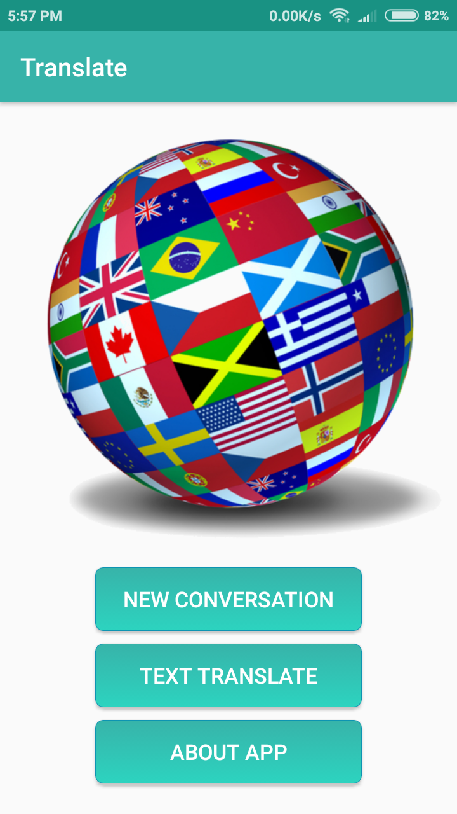
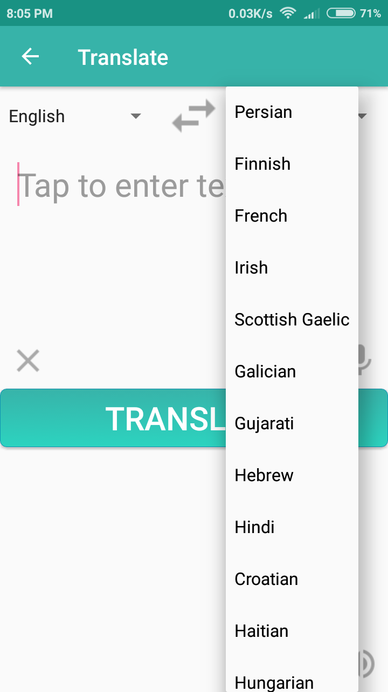
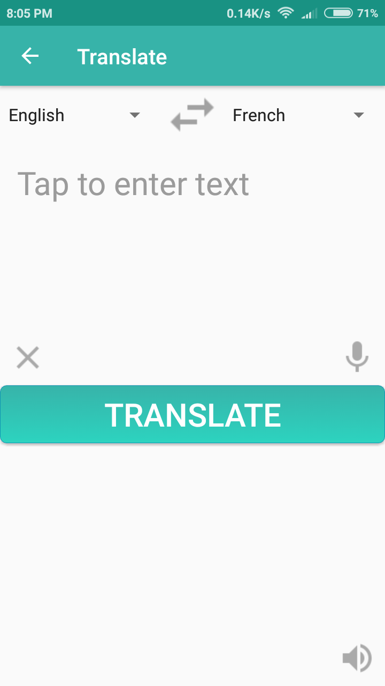
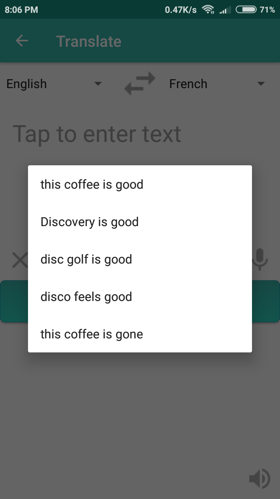
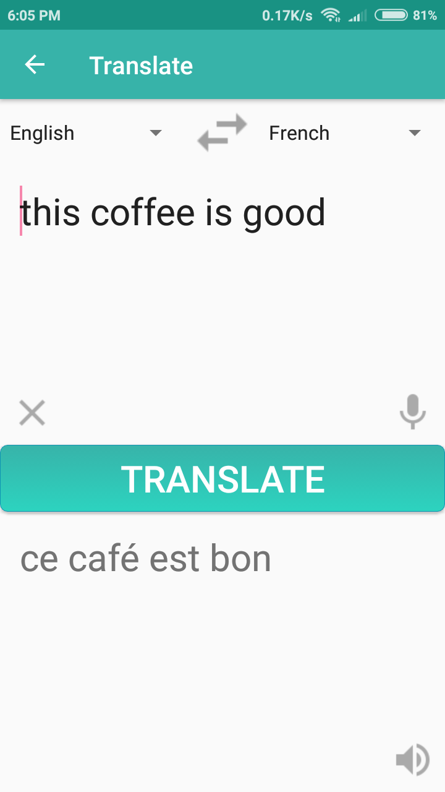
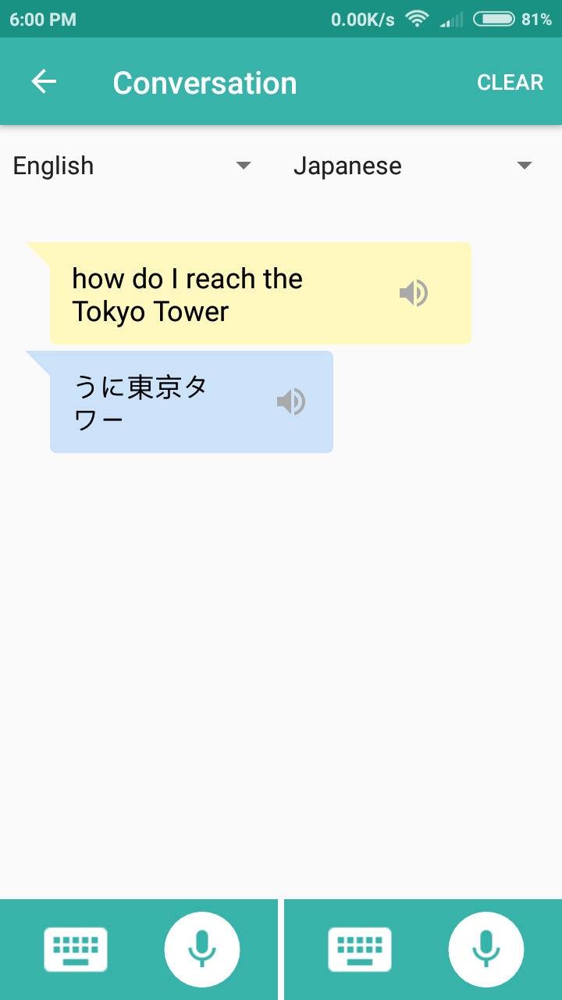
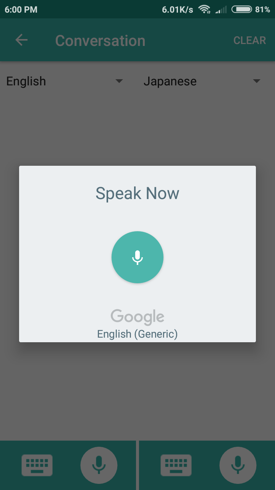
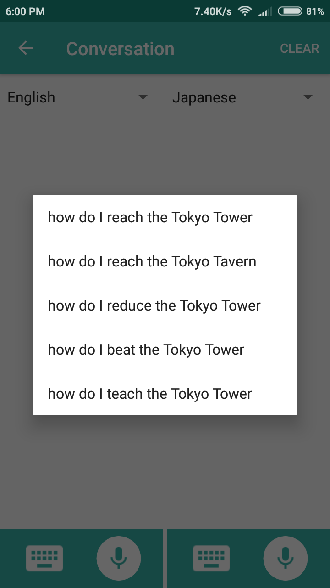
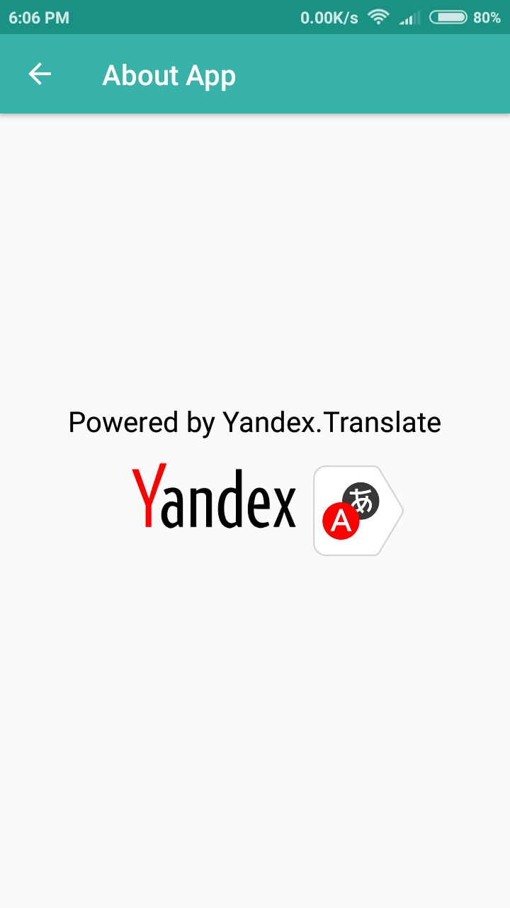

# TranslateApp
Translate is an android app to translate text conversations, supporting 90 languages with built in Speech-To-Text and Text-to-Speech features for ease of accessibility.

Download APK : [here](https://drive.google.com/open?id=1K6fCszUJhyBJzqRlfmsclkYVca1SNcBa)

## Overview

The app provides 2 modes of translation. 

* **Direct Mode** provides quick and easy translation, much like simple translators. Language pair and text can be swapped together quickly.
* **Conversation Mode** provides parallel translation in a conversation format acting as a handy translator between two users.

**Translation powered by :**  

Yandex Translate Web API : https://translate.yandex.com/

## Features

* Supports translation between any pair of 90 languages 
* Supports accessibility features like Speech-to-Text and Text-to-Speech
* Helpful tool to learn new languages, travel and translate on the go!

## App Screenshots

**Landing Screen**

**Simple Translate**

    
  

**Conversation Mode**

   
  

**About**

## Requirements

* Android SDK 21 or higher
* Active Internet access

## Contributing

Any improvements, bug reports, new features or suggestions are welcome. Feel free to contribrute. :)

## License

Licensed under the GNU GENERAL PUBLIC LICENSE Version 3, 29 June 2007 : https://www.gnu.org/licenses/gpl-3.0.en.html
Copyright (C) 2007 Free Software Foundation, Inc. <http://fsf.org/>
 

